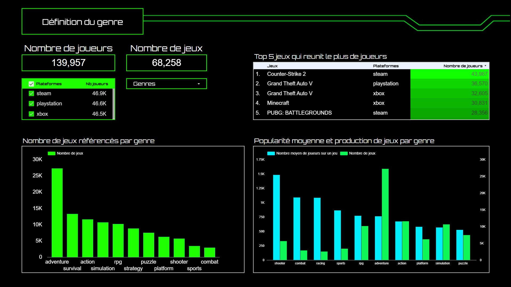
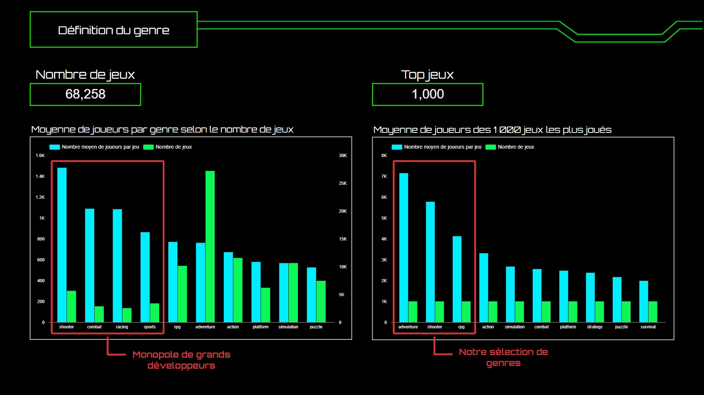
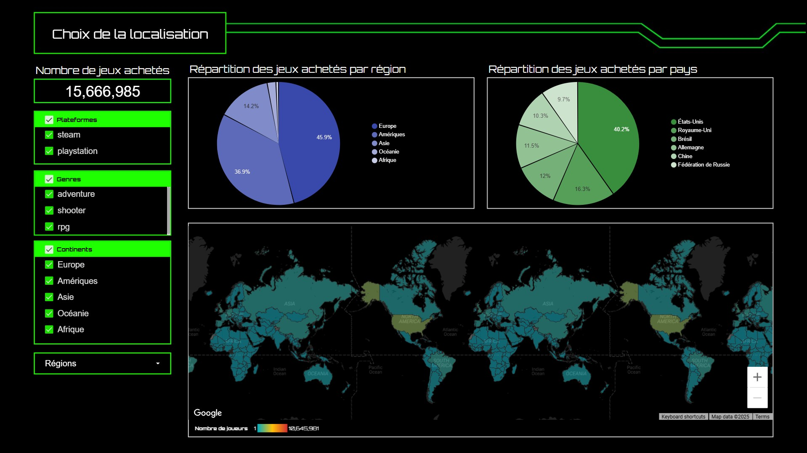
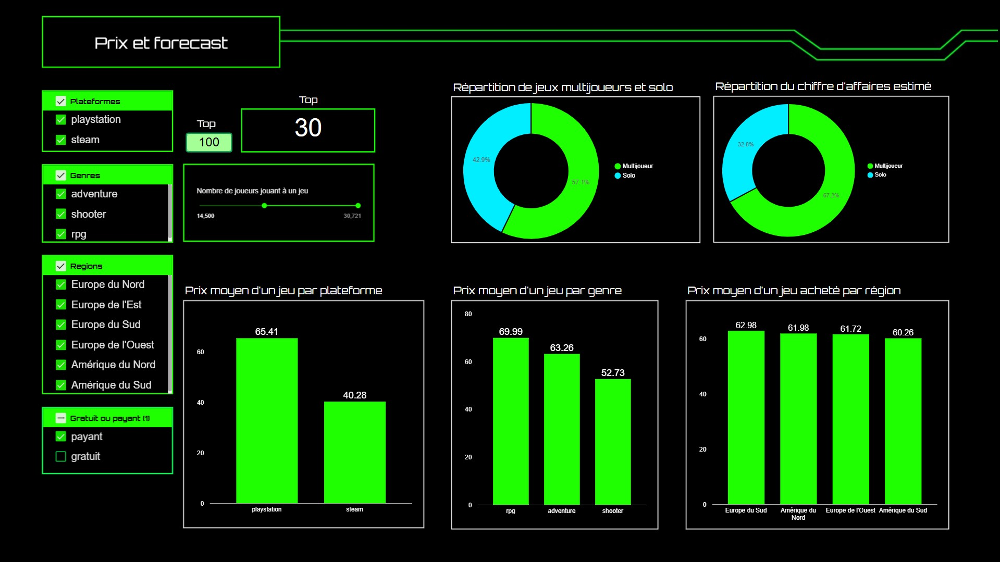
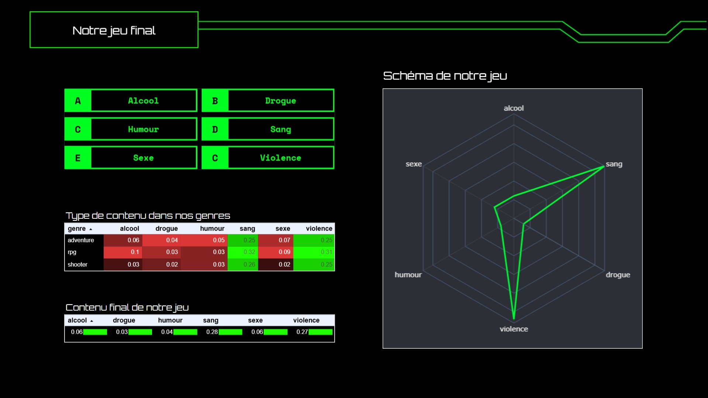

# Projet PIU PIU — Analyse de marché du jeu vidéo
**🎯 Ouvrir le dashboard :** [https://lookerstudio.google.com/embed/reporting/64f4f0d0-0df3-46b7-8be9-b57a98db3213/page/p_x405yj6vvd ](https://lookerstudio.google.com/embed/reporting/64f4f0d0-0df3-46b7-8be9-b57a98db3213/page/p_6vqzv75vvd)

**Objectif business :** Identifier le **sweet spot** (plateforme × genre × localisation × politique prix) pour cibler la stratégie produit et construire un **argumentaire investisseurs** pour le developpement d'un jeu vidéo à fort potentiel

---

## 📚 Sources de données

- **Gaming profiles (Playstation, Xbox, Steam)** — Kaggle  
  https://www.kaggle.com/datasets/artyomkruglov/gaming-profiles-2025-steam-playstation-xbox  
  - Dataset de **140 000 joueurs**
  - **68 000 jeux** référencés
  - Données de **2003-2025** 

- **Released games per plateform (1993-2024)** — Zenodo  
  https://zenodo.org/records/10797761

- **Best-selling game consoles (all-time)** — Kaggle  
  https://www.kaggle.com/datasets/tayyarhussain/best-selling-game-consoles-of-all-time

- **Best 500 video games launch prices** — IA generated

---

## 🔭 Introduction sur le monde du jeu vidéo (vue globale)
- **CA mondial 2024** : 184 Md $
- **Répartition du CA par plateforme** : Mobile 51 %, Console 28,6 %, PC 20,4 %
- **Catalogue jeux (1993–2023)** : ~100 000 jeux référencés

## 🎮 Plateformes & volumes (1993–2023)
- **Nombre de jeux sortis par plateforme** : PC/Steam volume plus important (écosystème ouvert, long tail plus dense)
- **Jeux mobiles** : cible très variée et volume de téléchargements beaucoup plus important (milliards de téléchargements)
- **Jeux Nintendo** : majoritairement développés par Nintendo et licences propres au constructeur
- **Guerres des consoles** : chute de ventes de Xbox, remontée en force de Nintendo

---

## 🏷️ Recommandations sur le genre de jeu
- Comparaison du **nombre de jeux référencés par genre** VS **nombre de joueurs moyen d'un jeu par genre**
- **Genres Shooter, Combat, Racing, Sports** : monopole de grands développeurs => trop concurrentiel

  → **Nos recommandations de genres** : Aventure, RPG, Shooter (genres moins concurrentiel mais avec les plus de potentiel)

---

## 🌍 Choix de la localisation
- **Base de +15 000 000 jeux achetés** (filtré sur 3 genres : Aventure, RPG, Shooter)
- **Choix de la zone géographique en fonction du nombre de jeux achetés** : Europe 45,9 % & Amérique 36,9 %
- **Focus sur les pays** : **Europe** (Royaume-Uni, Allemagne, Russie, Espagne, France) & **Amérique** (États-Unis, Canada, Brésil, Argentine)
- **Nombre de traductions nécessaires** : 6 (allemand, russe, espagnol, français, anglais, portugais)

---

## 💶 Pricing & monétisation
- **Proportion de jeux multijoueurs parmis les top 30 jeux les plus joués** : Multijoueur 57,1 % & Solo 42,9 %  
- **Répartition du CA par mode** : Multijoueur 67,2 % & Solo 32,8 %

  → **Recommandation** : inclure un mode multijoueur

- **Prix moyen des jeux par plateforme** : PlayStation 65,41€ & Steam 40,28€  
- **Prix moyen par genre** : RPG 69,99€, Aventure 63,26€, Shooter 52,73€

  → **Positionnement prix** : 64,99 €
  
  → **Plateformes ciblées** : lancement sur Steam + portage sur PlayStation

---

## 🧩 Contenu
- **Indices de contenu (proportions)** : Sang 0,28, Violence 0,27, Alcool 0,06, Sexe 0,06, Humour 0,04, Drogue 0,03

  → **Création du schéma** d'un jeu de type Aventure, Shooter, RPG  

---

## 🧠 Synthèse de nos recommandations et du best “sweet spot”
- **Genres** : Aventure/RPG/Shooter
- **Mode de jeu à inclure** : Multijoueur prioritaire  
- **Plateformes de lancement** : Steam pour l’accès/itération + portage PlayStation pour capter la base premium  
- **Régions de lancement** : **Europe** (Royaume-Uni, Allemagne, Russie, Espagne, France) & **Amérique** (États-Unis, Canada, Brésil, Argentine)
- **Nombre de traductions nécessaires** : 6 langues (allemand, russe, espagnol, français, anglais, portugais)  
- **Prix de lancement** : 64,99 €
