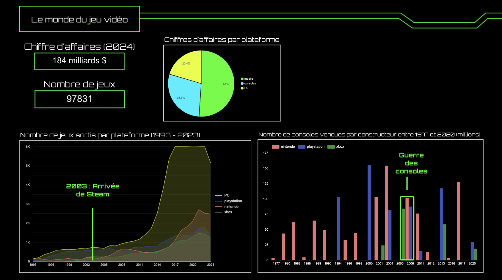
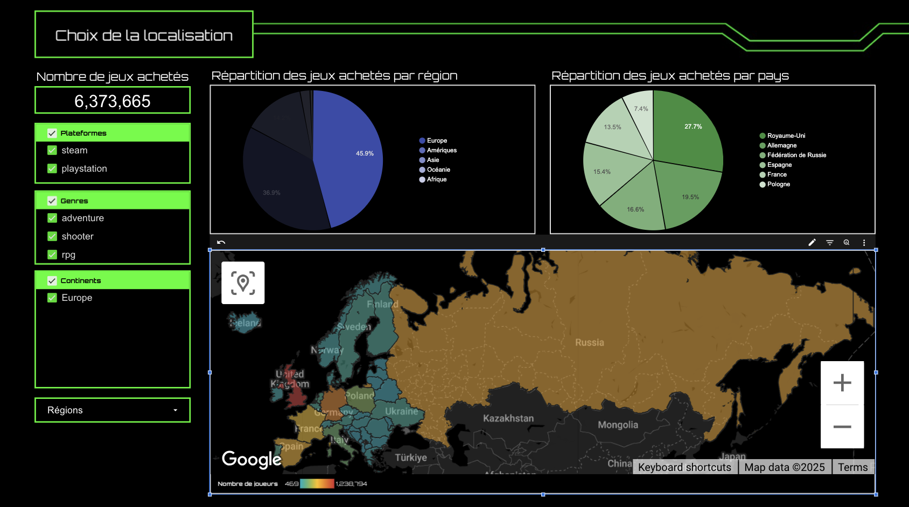
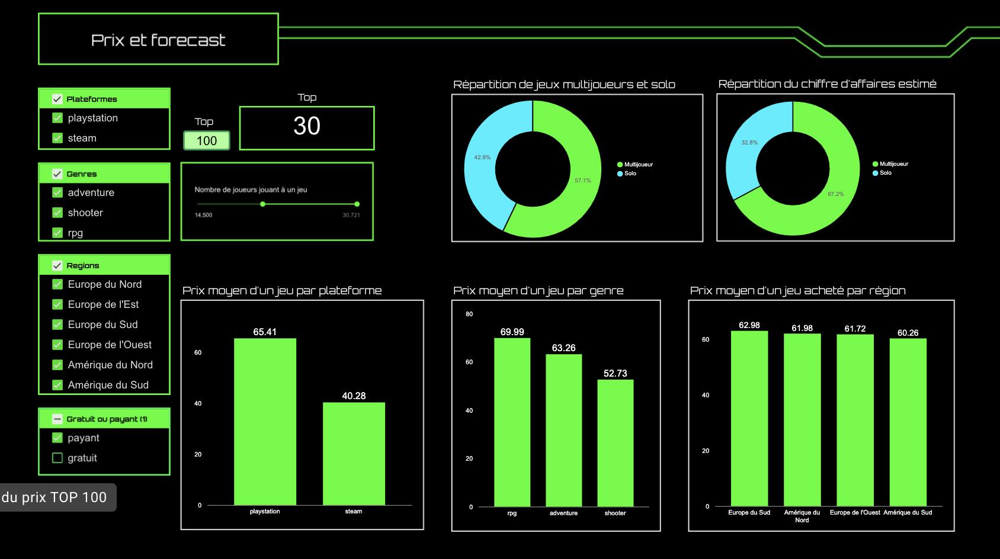
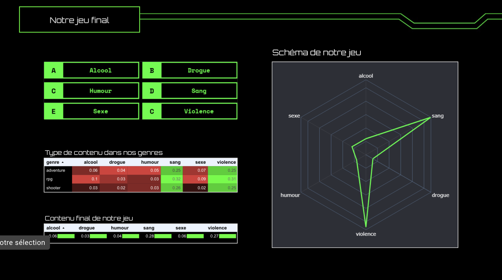

# Piu Piu — Analyse de marché du jeu vidéo
**🎯 Ouvrir le dashboard :** [https://lookerstudio.google.com/embed/reporting/64f4f0d0-0df3-46b7-8be9-b57a98db3213/page/p_x405yj6vvd ](https://lookerstudio.google.com/embed/reporting/64f4f0d0-0df3-46b7-8be9-b57a98db3213/page/p_6vqzv75vvd) 
**🌐 Portfolio :** https://samyomb.github.io

**Objectif business :** Identifier le **sweet spot** (plateforme × genre × localisation × monétisation) pour cibler la stratégie produit et construire un **argumentaire investisseurs** pour le developpement d'un jeu à fort potentiel.

## 🔭 Marché 2024 (vue globale)
- **CA mondial 2024** : **184 Md $**
- **Répartition du CA par plateforme** : **Mobile 51 %**, **Console 28,6 %**, **PC 20,4 %**

## 🧾 Données & périmètres (échantillons)
- **Catalogue jeux (1993–2023)** : **97 831 jeux** référencés.
- **Analyse “Genres”** : **140 000 joueurs**, **68 000 jeux** (plateformes : **PlayStation**, **Steam/PC**, **Xbox**).
- **Localisation / achats** : ~**15 667 000** jeux **achetés** (sélection centrée sur 3 genres : **Aventure**, **RPG**, **Shooter**).
- **Temporalité Pricing** : **2003–2024**.
- **Normalisation genres** : mapping sur **10 genres**.

## 🎮 Plateformes & volumes (1993–2023)
- **Nombre de jeux sortis par plateforme** : **PC/Steam** largement **devant** en volume (écosystème ouvert, long tail plus dense).
- **Jeux mobiles (casual) — téléchargements emblématiques** : **Roblox 2 Md**, **Pokémon GO 1 Md**, **Subway Surfers 1 Md**.
- **Nintendo** : les **casual games Nintendo** sont **exclusivement développés par Nintendo** (first-party).
- **Consoles — jalons (ventes cumulées, millions)** :  
  1994 **PlayStation (PS1) 102 M** · 2000 **PS2 155 M** · 2004 **Nintendo DS 154 M** ·  
  2005–2006 **guerre des consoles** · 2013 **PS4 117 M** · 2017 **Switch 127 M** · 2020 **PS5 20 M**.

## 🏷️ Genres (analyse échantillon)
- **Genre le plus référencé** : **Aventure** (sur PlayStation, Steam/PC, Xbox).
- **Moyennes de joueurs par genre** : calculées **sur l’ensemble** des jeux et **sur un top 1000** par genre (métriques visibles dans le dashboard).
- **Genres retenus** : **Aventure**, **RPG**, **Shooter**.

## 🌍 Localisation (échantillon achats ≈ 15 667 000)
- **Répartition par région (3 genres : Aventure, RPG, Shooter)** :  
  **Europe 45,9 %**, **Amérique 36,9 %**, **Asie 14,2 %**, **Autres/indéterminé ~3,0 %**.
- **Zones commerciales ciblées** :  
  **Europe** (Royaume-Uni, Allemagne, Russie, Espagne, France) · **Amérique** (États-Unis, Canada, Brésil, Argentine).
- **Langues prévues** : **6** — allemand, russe, espagnol, français, anglais, portugais.

## 💶 Pricing & monétisation (2003–2024)
**Périmètre** : Top 100 et **Top 30** des meilleurs jeux **PlayStation** & **Steam** (objectif : **s’inscrire dans le Top 30**).

- **Répartition des jeux par mode** : **Multijoueur 57,1 %**, **Solo 42,9 %**.  
- **Répartition du CA par mode** : **Multijoueur 67,2 %**, **Solo 32,8 %**.
- **Prix moyen par plateforme** : **PlayStation ~65 €**, **Steam ~40 €**  
  → Différentiel **+25 €** (≈ **+62,5 %** vs Steam).
- **Prix moyen par genre** : **RPG 69,99 €**, **Aventure 63 €**, **Shooter 53 €**  
  → RPG vs Aventure : **+6,99 €** (≈ **+11,1 %**) ; RPG vs Shooter : **+16,99 €** (≈ **+32,1 %**).
- **Prix moyen par région** : suivi dans le **dashboard**.
- **Panier moyen par joueur (genre & région)** : suivi dans le **dashboard**.
- **CA moyen par jeu et par genre** : suivi dans le **dashboard**.

**Positionnement prix Piu Piu** : **64,99 €**  
**Plateformes ciblées** : **Steam** (lancement) **+ portage PlayStation**.

## 🧩 Contenu & rating
- Indices de contenu (proportions) :  
  **Sang 0,28** (≈ **28 %**) · **Violence 0,27** (≈ **27 %**) ·  
  **Alcool ~0,05** · **Sexe ~0,05** · **Drogue ~0,05** · **Humour ~0,05** (≈ **5 %** chacun).  
Ces valeurs servent à **anticiper la classification** (PEGI/ESRB) et la **cible marketing**.

## 🧠 Synthèse “sweet spot” (décisions)
- **Plateformes** : **Steam** pour l’accès/itération + **portage PlayStation** pour capter la base premium (différentiel prix).  
- **Genres** : **Aventure/RPG/Shooter** (Aventure le plus référencé ; RPG = pricing plus élevé ; Shooter le plus apprécié).  
- **Mode** : **Multijoueur** prioritaire (57,1 % des titres ; 67,2 % du CA dans l’échantillon).  
- **Localisation** : cibler **Europe** (RU/DE/RU/ES/FR) & **Amérique** (US/CA/BR/AR) ; **6 langues** (DE, RU, ES, FR, EN, PT).  
- **Prix** : **64,99 €** (cohérent avec PS ~65 € ; alignement possible sur Steam via bundle/DLC).

## 📊 KPI de suivi (dans le dashboard)
- Répartition **Multi vs Solo** (titres & CA) – top 30 visé.  
- **Prix moyens** par **plateforme/genre/région**.  
- **Panier moyen** par joueur (genre, région).  
- **CA moyen** par jeu (genre).  
- Volumes **sorties par plateforme** & **par genre** (1993–2023).  
- Indicateurs **localisation** (répartition région/pays).

## 🔗 Liens
- **Dashboard (Looker Studio)** : https://lookerstudio.google.com/embed/reporting/64f4f0d0-0df3-46b7-8be9-b57a98db3213/page/p_x405yj6vvd
- **Portfolio** : https://samyomb.github.io

## 📚 Sources & licences

- **Gaming profiles (multi-plateformes)** — Kaggle  
  https://www.kaggle.com/datasets/artyomkruglov/gaming-profiles-2025-steam-playstation-xbox  

- **Best-selling game consoles (all-time)** — Kaggle  
  https://www.kaggle.com/datasets/tayyarhussain/best-selling-game-consoles-of-all-time  

- **Game metrics (divers)** — Zenodo  
  https://zenodo.org/records/10797761  

## 🗂️ Structure du repo (suggestion)
